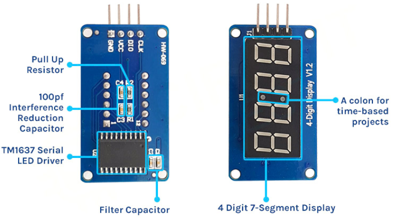

# Tecnológico Nacional de México
# Instituto Tecnológico de Tijuana
# Subdirección Académica
# Depto de Sistemas y Computación
# SEMESTRE: AGOSTO – DICIEMBRE 2023
# Ing. En Sistemas Computacionales
## SISTEMAS PROGRAMABLES 23a
## FECHA: 13 de septiembre del 2023

# Seven Segment Display (TM1637)
## Pantalla de 7 segmentos
La pantalla de 7 segmentos, también denominada consta de siete LED dispuestos en forma de '8'. Cada LED se denomina segmento porque cuando se ilumina forma parte de un dígito.

Cada segmento LED tiene uno de sus pines de conexión sacados directamente del paquete de plástico rectangular. Estos pines están etiquetados con las letras de la "a" a la "g". Los pines LED restantes están conectados entre sí para formar un único pin común.</h2>

Cada segmento se puede encender o apagar individualmente configurando el pin correspondiente en ALTO o BAJO, como un LED normal. Al iluminar segmentos individuales, puedes crear cualquier carácter numérico e incluso algunas representaciones básicas de letras.

## Descripción general del hardware del módulo TM1637
El módulo TM1637 combina una pantalla clásica de 7 segmentos, 4 dígitos y 0,36 ″ y el controlador LED TM1637 de Titan MicroElectronics, lo que le permite controlar todos los dígitos y los dos puntos utilizando solo dos pines de E/S.

El módulo TM1637 es ideal para mostrar datos de sensores o temperatura. También incluye dos puntos para usar en proyectos relacionados con el tiempo y el reloj.
El TM1637 se encarga de todo el trabajo de actualizar la pantalla después de que el microcontrolador la haya actualizado, lo cual es una buena ventaja. Esto libera al microcontrolador para hacer otras cosas importantes.

Tiene muchas funciones útiles, como la capacidad de ajustar el brillo de la pantalla y controlar cada segmento de forma independiente.
El módulo TM1637 funciona con un voltaje de suministro de 3,3 a 5 voltios y se comunica a través de un bus de dos cables, que requiere sólo dos pines de datos, VCC y tierra. El TM1637 tiene su propio protocolo de transferencia de datos, pero hay bibliotecas Arduino disponibles que ocultan las complejidades y facilitan la comunicación con la pantalla.

## Distribución de pines del módulo de pantalla de siete segmentos TM1637
A continuación se muestra la distribución de pines de la pantalla de siete segmentos de 4 dígitos TM1637 . Tiene 4 pines que son CLK, DIO, VCC y GND. Todos los pines de este módulo de sensor son digitales, excepto VCC y Tierra, y el dispositivo puede funcionar en el rango de voltaje de 3,3 V a 5 V. La distribución de pines del módulo de visualización de siete segmentos se muestra a continuación:

> * CLK: es el pin de entrada del reloj.
> * DIO: es el pin de E/S de datos.
> * VCC: es el pin de fuente de alimentación. A una feunte de alimentación de 3.3 v a 5 v.
> * GND: es el pin de tierra.

## Piezas del módulo de visualización de siete segmentos TM1637
El módulo TM1637 consta de dos partes; el primero es una pantalla de 7 segmentos de 4 dígitos y el segundo es el IC del controlador de pantalla de 7 segmentos TM1637. El IC admite muchas funcionalidades, incluido el control de encendido, apagado y brillo. Este IC también tiene una cola de datos, lo que significa que puede enviar todos los paquetes de datos al IC y el IC mostrará toda la información secuencialmente, dándole espacio a su microcontrolador para otras tareas.

## Aplicaciones
* Reloj de tiempo real.
* Temporizador
* Contador decimal
* Termómetro
  

> Termómetro

## Referencias
_Debashis, D. (2023, septiembre). Interfacing TM1637 4 digit seven segment display module with arduino. Circuit diges. Recuperado 9 de septiembre de 2023, de https://circuitdigest.com/microcontroller-projects/interfacing-tm1637-seven-segment-display-with-arduino_

_Engineers, L. M. (2023, 25 abril). Interfacing TM1637 4-Digit 7-Segment display with arduino. Last Minute Engineers. Recuperado 9 de septiembre de 2023, de https://lastminuteengineers.com/tm1637-arduino-tutorial/_
